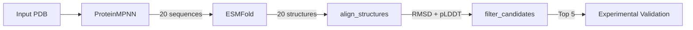

# Structural Alignment and Quality Metrics

Align predicted protein structures to a reference structure and calculate structural fidelity metrics including RMSD (Root Mean Square Deviation) and pLDDT confidence scores.

**Key Features**:
- Fast CPU-based alignment using BioPython
- Overall and motif-specific RMSD calculation
- pLDDT confidence score extraction
- Batch processing of multiple structures
- Detailed per-structure metrics in JSON format

## Use Cases

- ✅ **Design validation**: Verify designed sequences fold to target structure
- ✅ **ProteinMPNN + ESMFold workflow**: Check if MPNN sequences realize intended backbone
- ✅ **Quality filtering**: Identify high-fidelity designs before experimental validation
- ✅ **Motif preservation**: Ensure functional regions maintain correct geometry
- ✅ **Batch screening**: Process multiple predictions efficiently

## Key Metrics

### RMSD (Root Mean Square Deviation)
- **Overall RMSD**: Alignment of all CA atoms
- **Motif RMSD**: Alignment of specified functional residues
- **Units**: Angstroms (Å)
- **Interpretation**:
  - < 1.0 Å: Excellent structural fidelity
  - 1.0-2.0 Å: Good fidelity, acceptable for most designs
  - 2.0-3.0 Å: Moderate deviation, may need refinement
  - > 3.0 Å: Poor fidelity, significant structural changes

### pLDDT (Predicted Local Distance Difference Test)
- Extracted from B-factor column in PDB files
- Per-residue confidence scores (0-100)
- **Interpretation**:
  - > 90: Very high confidence
  - 70-90: High confidence
  - 50-70: Medium confidence (some uncertainty)
  - < 50: Low confidence (likely disordered or incorrect)

## Examples

### Basic Alignment (ProteinMPNN + ESMFold Workflow)

Align 10 ESMFold predictions back to input PDB:

```python
{
  "reference_pdb_gcs_uri": "gs://dev-services/runs/run_001/input/1ALU.pdb",
  "predicted_structures_gcs_uris": [
    "gs://dev-services/runs/run_001/esmfold/seq_001.pdb",
    "gs://dev-services/runs/run_001/esmfold/seq_002.pdb",
    "gs://dev-services/runs/run_001/esmfold/seq_003.pdb",
    ...
  ]
}
```

**Output**: JSON with alignment metrics for each structure
```json
{
  "alignments": [
    {
      "structure_uri": "gs://.../seq_001.pdb",
      "sequence_id": "seq_001",
      "rmsd_overall": 1.23,
      "mean_plddt": 82.4,
      "min_plddt": 65.2,
      "num_aligned_residues": 150
    },
    ...
  ],
  "summary": {
    "num_structures": 10,
    "num_successful": 10,
    "rmsd_mean": 1.8,
    "rmsd_min": 0.9,
    "rmsd_max": 2.4,
    "plddt_mean": 78.5
  }
}
```

**Runtime**: ~30-60 seconds for 10 structures (CPU)

### Motif-Focused Alignment

Check if catalytic residues maintain correct geometry:

```python
{
  "reference_pdb_gcs_uri": "gs://dev-services/runs/run_001/input/enzyme.pdb",
  "predicted_structures_gcs_uris": [...],
  "motif_residues": "A45,A67,A89,A123"
}
```

**Output**: Includes both overall and motif-specific metrics
```json
{
  "structure_uri": "gs://.../seq_001.pdb",
  "sequence_id": "seq_001",
  "rmsd_overall": 1.5,
  "rmsd_motif": 0.7,
  "mean_plddt": 82.4,
  "mean_plddt_motif": 88.3,
  "min_plddt_motif": 85.1
}
```

**Use case**: Ensure active site geometry preserved while allowing peripheral regions to vary

### Binder Design Validation

Align designed binder structures to check interface preservation:

```python
{
  "reference_pdb_gcs_uri": "gs://dev-services/runs/run_002/rfdiffusion/binder_design.pdb",
  "predicted_structures_gcs_uris": [
    "gs://dev-services/runs/run_002/esmfold/binder_seq_001.pdb",
    ...
  ],
  "motif_residues": "B15,B18,B22,B25,B28"  # Hotspot residues
}
```

**Interpretation**:
- Low motif RMSD (< 1.0 Å): Hotspot geometry preserved
- High motif pLDDT (> 85): Confident interface prediction
- Overall RMSD: Full backbone fidelity

## Typical Workflow: ProteinMPNN → ESMFold → Alignment → Filter



**Workflow Spec Example**:
```json
{
  "nodes": [
    {"id": "mpnn", "op": "proteinmpnn", "params": {"num_sequences": 20}},
    {"id": "fold", "op": "esmfold", "params": {"fasta_str": "$artifacts.sequences"}},
    {"id": "align", "op": "align_structures", "params": {
      "reference_pdb_gcs_uri": "$artifacts.input_pdb",
      "predicted_structures_gcs_uris": "$artifacts.structures",
      "motif_residues": "A45,A67,A89"
    }},
    {"id": "filter", "op": "filter_candidates", "params": {
      "metrics": "$artifacts.alignment_metrics",
      "thresholds": {"rmsd_max": 2.0, "plddt_min": 70}
    }}
  ],
  "edges": [
    {"src": "START", "dst": "mpnn"},
    {"src": "mpnn", "dst": "fold"},
    {"src": "fold", "dst": "align"},
    {"src": "align", "dst": "filter"}
  ]
}
```

## Quality Guidelines

### Structural Fidelity (Did the sequence realize the design?)

| Metric | Excellent | Good | Acceptable | Poor |
|--------|-----------|------|------------|------|
| **Overall RMSD** | < 1.0 Å | 1.0-2.0 Å | 2.0-3.0 Å | > 3.0 Å |
| **Motif RMSD** | < 0.5 Å | 0.5-1.0 Å | 1.0-1.5 Å | > 1.5 Å |
| **Mean pLDDT** | > 85 | 70-85 | 50-70 | < 50 |
| **Min pLDDT (Motif)** | > 80 | 65-80 | 50-65 | < 50 |

### Filtering Recommendations

**Conservative (High Confidence)**:
- Overall RMSD < 1.5 Å
- Motif RMSD < 1.0 Å (if applicable)
- Mean pLDDT > 80
- Min pLDDT (motif) > 75

**Moderate (Good Fidelity)**:
- Overall RMSD < 2.0 Å
- Motif RMSD < 1.5 Å
- Mean pLDDT > 70
- Min pLDDT (motif) > 65

**Permissive (Screening)**:
- Overall RMSD < 3.0 Å
- Mean pLDDT > 60

## Output Format

### JSON Output Structure

```json
{
  "exit_code": 0,
  "output_files": [
    {
      "gcs_url": "gs://bucket/runs/run_001/align_structures/alignment_metrics.json",
      "filename": "alignment_metrics.json",
      "artifact_type": "json",
      "size": 12345
    }
  ],
  "message": "Aligned 18/20 structures successfully",
  "metadata": {
    "alignments": [
      {
        "structure_uri": "gs://.../seq_001.pdb",
        "sequence_id": "seq_001",
        "rmsd_overall": 1.23,
        "rmsd_motif": 0.87,
        "num_aligned_residues": 150,
        "mean_plddt": 82.4,
        "min_plddt": 65.2,
        "max_plddt": 94.1,
        "mean_plddt_motif": 88.3,
        "min_plddt_motif": 85.1
      },
      {
        "structure_uri": "gs://.../seq_002.pdb",
        "sequence_id": "seq_002",
        "error": "No matching CA atoms found",
        "rmsd_overall": null,
        "mean_plddt": null
      }
    ],
    "summary": {
      "num_structures": 20,
      "num_successful": 18,
      "num_failed": 2,
      "rmsd_mean": 1.8,
      "rmsd_min": 0.9,
      "rmsd_max": 4.2,
      "plddt_mean": 78.4,
      "plddt_min": 62.1,
      "plddt_max": 89.3
    }
  }
}
```

### Alignment Metrics Per Structure

Each structure returns:
- `structure_uri`: GCS URI of predicted structure
- `sequence_id`: Identifier (extracted from filename)
- `rmsd_overall`: Overall CA atom RMSD (Å)
- `rmsd_motif`: Motif-specific RMSD (Å), if motif_residues provided
- `num_aligned_residues`: Number of CA atoms used for alignment
- `mean_plddt`: Average pLDDT across all residues
- `min_plddt`: Minimum pLDDT (flags low-confidence regions)
- `max_plddt`: Maximum pLDDT
- `mean_plddt_motif`: Average pLDDT for motif residues
- `min_plddt_motif`: Minimum pLDDT in motif region
- `error`: Error message (if alignment failed)

## Command Line Testing

```bash
# Basic alignment
modal run modal_align_structures.py \
  --reference-pdb gs://bucket/reference.pdb \
  --structures gs://bucket/pred1.pdb,gs://bucket/pred2.pdb

# With motif residues
modal run modal_align_structures.py \
  --reference-pdb gs://bucket/reference.pdb \
  --structures gs://bucket/pred1.pdb,gs://bucket/pred2.pdb \
  --motif-residues A45,A67,A89

# Local testing
modal run modal_align_structures.py \
  --reference-pdb ./reference.pdb \
  --structures ./pred1.pdb,./pred2.pdb \
  --out-dir ./out/alignment_test
```

## Performance

| Metric | Value | Notes |
|--------|-------|-------|
| **Runtime** | ~3-6 sec/structure | CPU only |
| **Batch of 10** | ~30-60 seconds | Includes GCS download |
| **Batch of 50** | ~3-5 minutes | Linear scaling |
| **Timeout** | 15 minutes | Default |
| **GPU** | None | CPU sufficient |

**Cost Estimate** (Modal CPU @ ~$0.10/hr):
- Per structure: < $0.001
- Batch of 50: ~$0.01

## Troubleshooting

**Issue**: `No matching CA atoms found between structures`
**Solution**: 
- Structures have different lengths or chain IDs
- Ensure reference and predicted structures have same sequence length
- Check that both structures have CA atoms (not just backbone)

**Issue**: `Invalid GCS URI format`
**Solution**:
- Ensure GCS URIs start with `gs://`
- Format: `gs://bucket-name/path/to/file.pdb`
- Check that bucket and file exist

**Issue**: High RMSD (> 3.0 Å) for all structures
**Solution**:
- Sequences may not be designable for target fold
- Try lower ProteinMPNN temperature (0.05-0.1)
- Consider fixing more residues (fixed_positions)
- Use AlphaFold instead of ESMFold for final validation

**Issue**: Low pLDDT (< 50) in motif region
**Solution**:
- Motif may be in disordered region
- Check if motif residues are correct (1-indexed)
- ESMFold may struggle with this region - try AlphaFold

## Integration

### Workflow Integration

This tool is designed to work seamlessly with:
- **ProteinMPNN**: Sequence design upstream
- **ESMFold**: Fast structure prediction upstream
- **filter_candidates**: Threshold-based filtering downstream
- **generate_report**: Actionable report generation downstream

### Artifact Flow

**Input artifacts** (from previous nodes):
- `input_pdb` or `reference_pdb` → `reference_pdb_gcs_uri`
- `structures` (list of GCS URIs) → `predicted_structures_gcs_uris`

**Output artifacts** (for downstream nodes):
- `alignment_metrics` (JSON) → Used by filter_candidates
- Summary statistics → Used by generate_report

## Related Tools

- **[proteinmpnn](../proteinmpnn/SKILL.md)**: Generate sequences for alignment
- **[esmfold](../esmfold/SKILL.md)**: Predict structures before alignment
- **[alphafold](../alphafold/SKILL.md)**: Higher-accuracy alternative to ESMFold
- **filter_candidates**: Apply thresholds to alignment metrics
- **generate_report**: Create comprehensive quality reports

## References

- **BioPython PDB Module**: Structure parsing and Superimposer
- **RMSD Definition**: Root mean square deviation of atomic positions
- **pLDDT**: Predicted Local Distance Difference Test (AlphaFold/ESMFold confidence metric)
- **AlphaFold2**: Jumper et al., "Highly accurate protein structure prediction with AlphaFold" (Nature, 2021)
- **ESMFold**: Lin et al., "Evolutionary-scale prediction of atomic-level protein structure" (Science, 2023)
